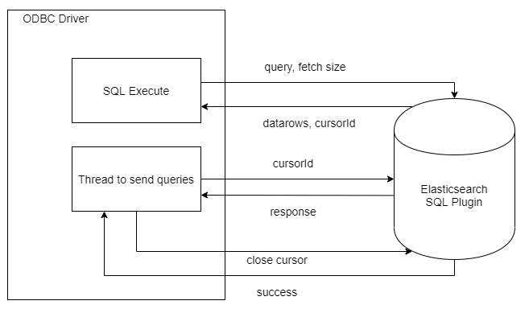
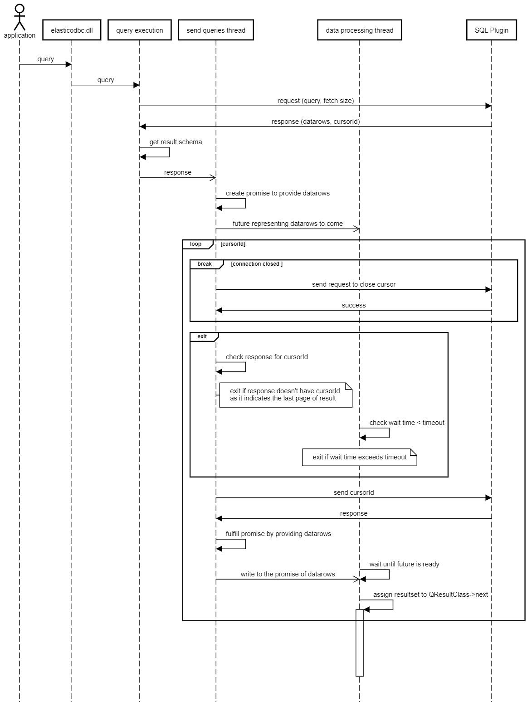

# Opendistro ODBC Driver Cursor (Pagination) Support Design Documentation

## Overview
Elasticsearch ODBC Driver supports forward-only cursor. This document illustrates how the cursor(pagination) is handled in driver. 

For information on how the pagination is supported on Elasticsearch server, check [Opendistro SQL Cursor (Pagination) Support](https://github.com/opendistro-for-elasticsearch/sql/blob/master/docs/dev/Pagination.md).

## Data Flow

 

* ODBC Driver will provide an option to define fetch size as a connection parameter.
* If fetch size is not given or zero then number of rows per request will be as per server defined default fetch size.
* ODBC Driver will send the request to close cursor whenever connection is closed.

## Detailed Design

