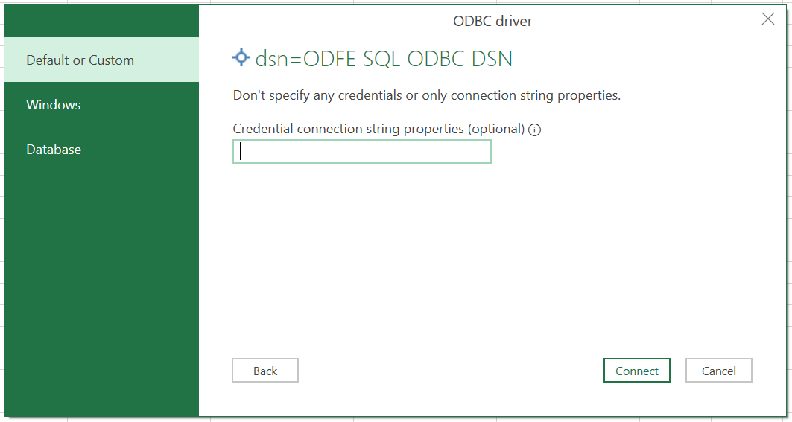
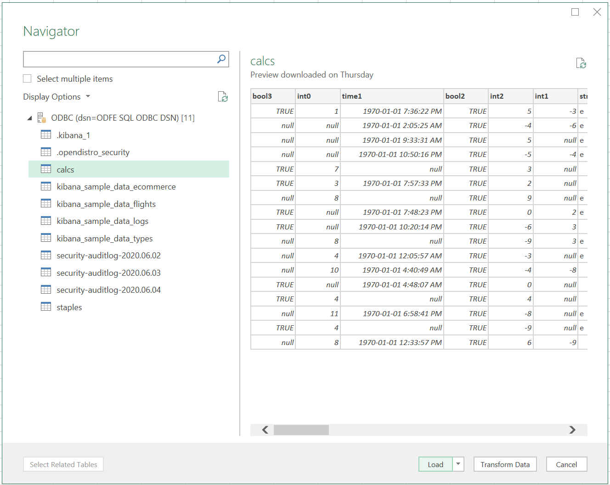

# Testing Microsoft Excel Connection

## Prerequisites
* [Download and install](../../README.md) Open Distro for Elasticsearch SQL ODBC Driver.
* [Install and configure](https://opendistro.github.io/for-elasticsearch-docs/docs/install/) Open Distro for Elasticsearch.
* Open ODBC Data Source Administrator. Click on System DSN > ODFE SQL ODBC DSN > Configure.
* Set all connection options & Click on Test. Connection test should return `Connection Successful`.

## Microsoft Excel Connectivity

### ODBC as data source

* Open blank workbook in Microsoft Excel.
* Click on Data > Get Data > From Other Sources > From ODBC

* Select ODFE SQL ODBC DSN. Click OK.

* Select Default/Custom in connection credentials windows and click on Connect.

* Select a table from list to load data preview. Click on Load.

