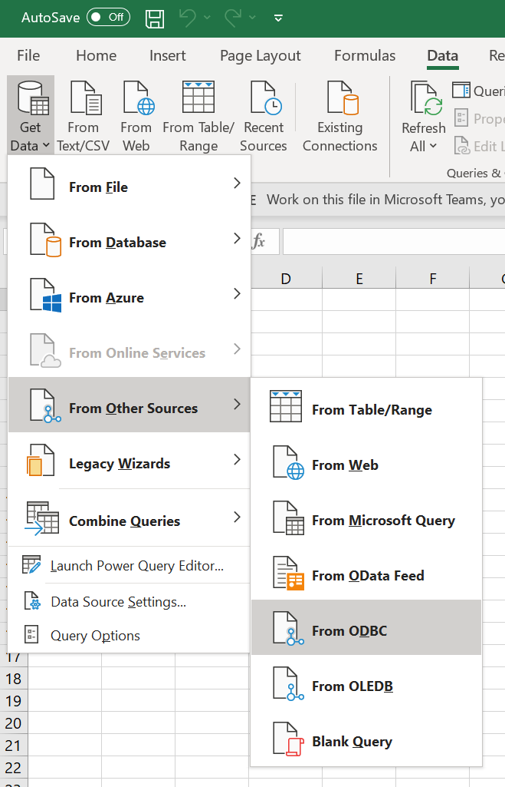

## Test ODBC as data source

* Open blank workbook in Microsoft Excel.
* Click on Data > Get Data > From Other Sources > From ODBC

* Select ODFE SQL ODBC DSN. Click OK.

* Select Default/Custom in connection credentials windows and click on Connect.

* Select a table from list to load data preview. Click on Load.

#### Test Advanced options

* Click on Advanced options after selecting DSN.
* Add some connection options in Connection string.
* Add any supported SQL statement.

* Click on OK. 
* Select Default option for authentication and Click on Connect.

* Data preview should be available. Load Data in spreadsheet.

* Data loaded in the spreadsheet

NOTE: Check driver logs for verify modified connection string options.
