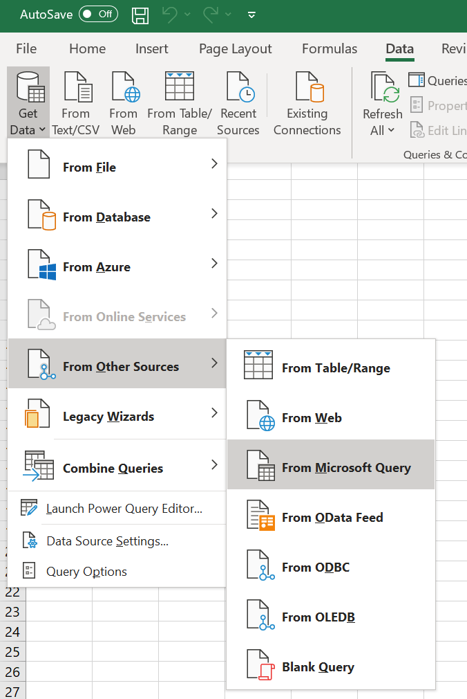
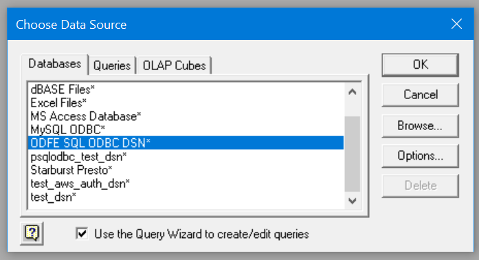

## Query Wizard Connection

* Open blank workbook in Microsoft Excel.
* Click on **Data** > **Get Data** > **From Other Sources** > **From Microsoft Query**

* Select **Databases** > **ODFE SQL ODBC DSN**. 
* Ensure the **Use the Query Wizard to create/edit queries** check box is selected, and then click **OK**.

